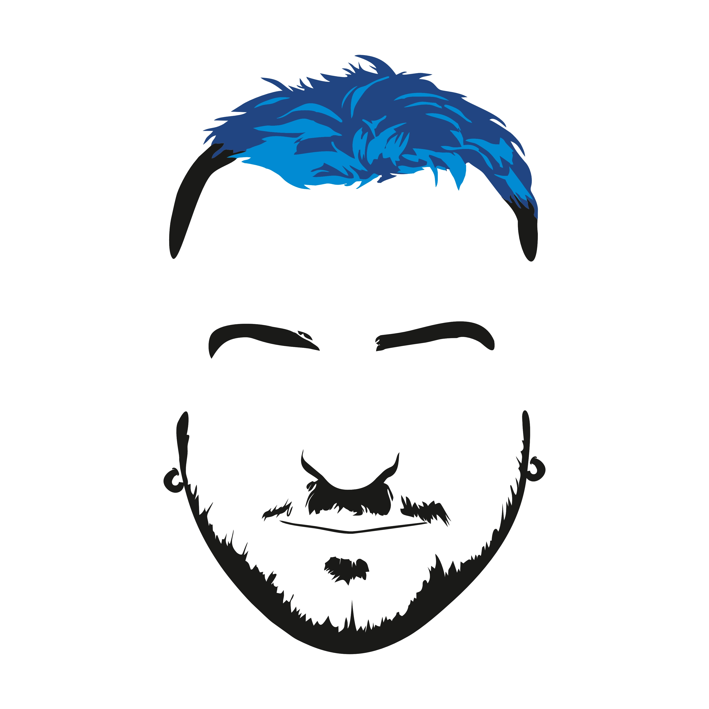
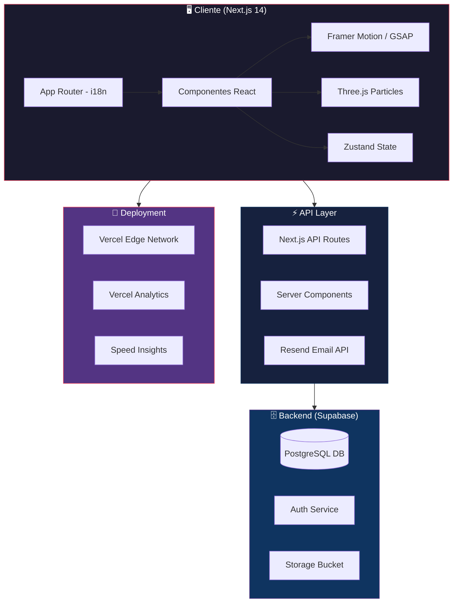
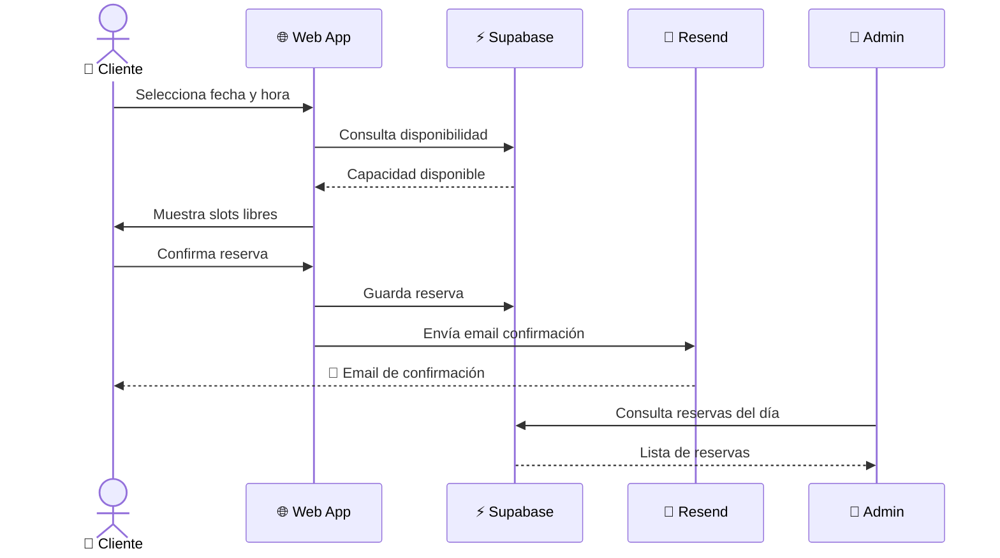
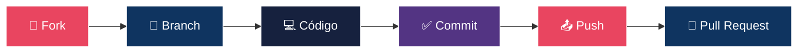
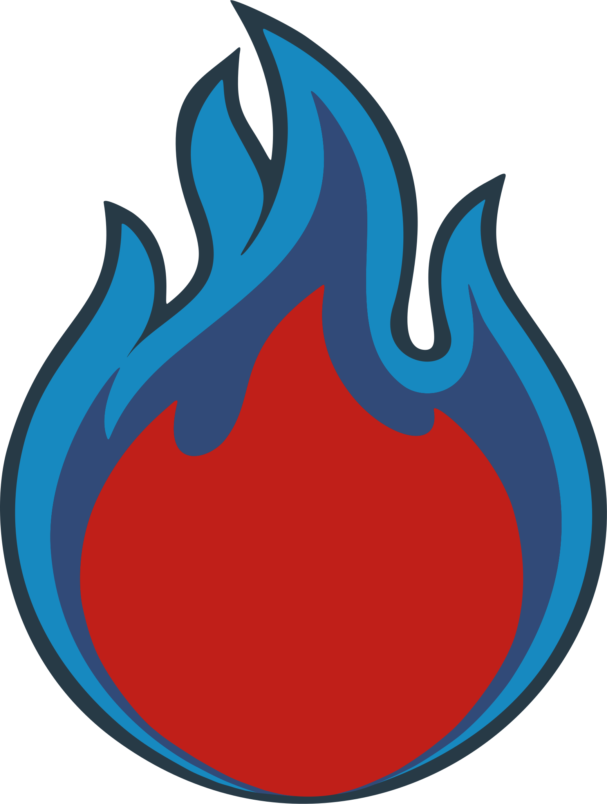

<div align="center">

<!-- Logo principal -->


# 🔥 La Parrilla de Champi

### *Donde el sabor se encuentra con la tecnología*

[](https://nextjs.org/)
[](https://reactjs.org/)
[](https://www.typescriptlang.org/)
[](https://tailwindcss.com/)
[](https://supabase.com/)
[](https://vercel.com/)
[](LICENSE)

---

**Plataforma web completa para la gestión integral de un restaurante de parrilla: carta digital interactiva, sistema de reservas en tiempo real y panel de administración.**

[🌐 Ver Demo](#) · [🐛 Reportar Bug](https://github.com/aleglope/la-parrilla-de-champi/issues) · [✨ Solicitar Feature](https://github.com/aleglope/la-parrilla-de-champi/issues)

</div>

---

## 📋 Tabla de Contenidos

- [Características](#-características)
- [Arquitectura](#-arquitectura)
- [Tech Stack](#-tech-stack)
- [Estructura del Proyecto](#-estructura-del-proyecto)
- [Instalación](#-instalación)
- [Variables de Entorno](#-variables-de-entorno)
- [Uso](#-uso)
- [Contribución](#-contribución)
- [Licencia](#-licencia)
- [Contacto](#-contacto)

---

## ✨ Características

<table>
<tr>
<td width="50%">

### 🍖 Carta Digital Interactiva
- Gestión dinámica de platos y categorías
- Imágenes optimizadas con **Sharp**
- Filtrado por categorías con tabs animados
- Soporte multiidioma (ES / EN)

</td>
<td width="50%">

### 📅 Sistema de Reservas
- Calendario interactivo con **React Day Picker**
- Gestión de capacidad en tiempo real
- Días de cierre configurables
- Reservas manuales desde el panel admin

</td>
</tr>
<tr>
<td width="50%">

### 🎨 Experiencia Visual Premium
- Animaciones fluidas con **Framer Motion** y **GSAP**
- Sistema de partículas con **Three.js**
- Hero Bento Box con logo reveal animado
- Diseño responsive pixel-perfect

</td>
<td width="50%">

### 🔐 Panel de Administración
- Autenticación segura con **Supabase Auth**
- CRUD completo de platos y categorías
- Dashboard de reservas con filtros
- Subida y compresión de imágenes

</td>
</tr>
</table>

---

## 🏗 Arquitectura



### Flujo de Reservas



---

## 🛠 Tech Stack

<div align="center">

| Categoría | Tecnologías |
|:-:|:-:|
| **Frontend** |    |
| **Estilos** |   |
| **Animaciones** |    |
| **Backend** |   |
| **Email** |  |
| **Deploy** |  |
| **Estado** |  |

</div>

---

## 📁 Estructura del Proyecto

```
la-parrilla-de-champi/
├── 📂 app/
│   └── 📂 [lang]/                # Rutas internacionalizadas (es/en)
│       ├── 📄 page.tsx           # Página principal
│       ├── 📂 menu/              # Carta digital
│       ├── 📂 reservas/          # Sistema de reservas
│       ├── 📂 admin/             # Panel de administración
│       │   ├── 📂 login/         # Autenticación admin
│       │   └── 📂 reservations/  # Gestión de reservas
│       ├── 📂 aviso-legal/       # Aviso legal
│       ├── 📂 politica-privacidad/
│       └── 📂 politica-cookies/
├── 📂 components/
│   ├── 📂 admin/                 # Componentes del panel admin
│   ├── 📂 hero/                  # Hero section con animaciones
│   ├── 📂 layout/                # Footer, estructura
│   ├── 📂 menu/                  # Carta y platos
│   ├── 📂 navigation/            # Menú burbuja + navegación
│   ├── 📂 particles/             # Sistema de partículas 3D
│   ├── 📂 reservations/          # Formulario de reservas
│   ├── 📂 sections/              # CTA y secciones
│   ├── 📂 social/                # Redes sociales
│   ├── 📂 story/                 # Sección "Nuestra Historia"
│   └── 📂 ui/                    # Componentes reutilizables
├── 📂 lib/
│   └── 📂 i18n/                  # Contexto de idioma
├── 📂 public/                    # Assets estáticos y logos
└── 📄 tailwind.config.ts         # Configuración Tailwind
```

---

## 🚀 Instalación

### Prerrequisitos

- 
-  o 

### Pasos

```bash
# 1. Clonar el repositorio
git clone https://github.com/aleglope/la-parrilla-de-champi.git

# 2. Entrar al directorio
cd la-parrilla-de-champi

# 3. Instalar dependencias
npm install

# 4. Configurar variables de entorno
cp .env.example .env.local

# 5. Ejecutar en desarrollo
npm run dev
```

> La aplicación estará disponible en `http://localhost:3000`

---

## 🔑 Variables de Entorno

Crea un archivo `.env.local` en la raíz del proyecto:

```env
# Supabase
NEXT_PUBLIC_SUPABASE_URL=tu_url_de_supabase
NEXT_PUBLIC_SUPABASE_ANON_KEY=tu_clave_anonima
SUPABASE_SERVICE_ROLE_KEY=tu_clave_de_servicio

# Resend (Email)
RESEND_API_KEY=tu_clave_de_resend
```

---

## 💻 Uso

| Comando | Descripción |
|---------|-------------|
| `npm run dev` | 🔧 Servidor de desarrollo con hot-reload |
| `npm run build` | 📦 Build de producción optimizado |
| `npm run start` | 🚀 Servidor de producción |
| `npm run lint` | 🔍 Análisis estático con ESLint |

---

## 🤝 Contribución

¡Las contribuciones son bienvenidas! Sigue estos pasos:



1. **Fork** el repositorio
2. Crea tu rama (`git checkout -b feature/MiFeature`)
3. Commitea tus cambios (`git commit -m 'feat: añadir nueva característica'`)
4. Push a la rama (`git push origin feature/MiFeature`)
5. Abre un **Pull Request**

---

## 📄 Licencia

Este proyecto está bajo la **Licencia MIT**. Consulta el archivo [`LICENSE`](LICENSE) para más detalles.

---

## 📬 Contacto

<div align="center">

[](https://github.com/aleglope)
[](https://github.com/aleglope/la-parrilla-de-champi/issues)

---



**Hecho con ❤️ y mucha parrilla**

</div>
